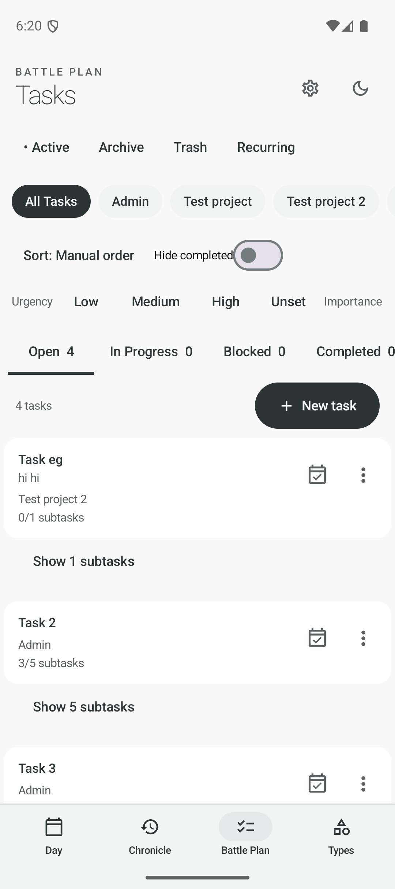

# Battle Plan mobile redesign decomposition

## Purpose

Battle Plan is the app's task-planning workspace. It lets a user organize work by lifecycle collection, project, workflow status, priority, type, and recurrence; then create, edit, reorder, complete, archive, trash, restore, and schedule tasks as "Ready to Plan."

This document divides the feature into redesign-ready parts. Each part can become a separate Figma component, screen, or flow while preserving the current product behavior.

## Current state

Capture: Android emulator, 1080 × 2424 px, light theme, Active / All Tasks / Open selected, 4 open tasks.

## 1. Feature architecture

### A. App shell and entry point

- Global header: section eyebrow (`BATTLE PLAN`), page title (`Tasks`), Settings, theme toggle.
- Global bottom navigation: Day, Chronicle, Battle Plan, Types.
- Battle Plan is the selected destination.
- Redesign output: one mobile shell component, selected/unselected navigation states, light/dark variants.

### B. Collection switcher

- Destinations: Active, Archive, Trash, Recurring.
- Active contains the working task board.
- Archive and Trash are task collections; Recurring opens a separate template workflow.
- Current selected treatment is a leading bullet.
- Redesign output: a primary Battle Plan sub-navigation pattern with selected, pressed, overflow, and narrow-width behavior.

### C. Scope / project selector

- Scopes: All Tasks, Admin, and each project.
- `Admin` means tasks without a project.
- A trailing add control creates a project.
- When a project is selected, an Edit project action appears.
- The selected scope persists locally on the device.
- Redesign output: project/scope selector, add-project affordance, project-selected state, long-name and many-project behavior.

### D. Sort and filter system

- Sort options: Manual order, Deadline, Urgency, Importance.
- Hide completed toggle.
- Urgency multi-select: Low, Medium, High, Unset.
- Importance multi-select: Low, Medium, High, Unset.
- Task type multi-select: Unset plus all configured task types.
- Clear filters appears only when at least one filter is active.
- Archive completed appears only when eligible completed tasks exist in the current scope.
- Redesign output: compact collapsed state, expanded filter sheet/panel, active-filter summary/badge, sort menu, and clear/apply behavior.

### E. Workflow status navigation

- Statuses: Open, In Progress, Blocked, Completed.
- Each status displays its filtered task count.
- Mobile shows one status list at a time.
- At widths of 840 dp or more, the implementation becomes a four-column board.
- The selected status persists locally on the device.
- Redesign output: mobile status control, count treatment, zero-count state, tablet four-column board, and responsive transition rules.

### F. List header and primary action

- Displays the number of visible tasks.
- New task opens a quick-create dialog and defaults the new task to the selected status and scope.
- Redesign output: list summary plus a persistent, reachable primary create action that works with long/empty lists and the keyboard.

### G. Task card

Information that may appear:

- Title.
- Description, truncated to two lines.
- Project name or Admin.
- Task type.
- Overdue indicator.
- Urgency and importance.
- Date-only or date-and-time deadline.
- Recurring template name.
- Completed/total subtask count.
- Ready to Plan state.

Actions:

- Tap card to open details.
- Toggle Ready to Plan from the card.
- Overflow menu moves the task to another status.
- In Manual order, overflow also offers Move earlier / Move later.

Redesign output: card anatomy, metadata priority rules, compact/expanded variants, overdue/ready/completed states, menu, loading/disabled state, and accessibility labels.

### H. Inline subtask module

- A task with subtasks can expand/collapse its child list.
- Each child can be opened, completed, or reopened.
- A new subtask can be added inline.
- A task without subtasks exposes Add subtask.
- Redesign output: collapsed progress summary, expanded child list, add-subtask input, completed child state, and clear visual containment within the parent card.

### I. Quick-create task dialog

- Fields: title and description.
- In All Tasks, project can be chosen; otherwise the selected project scope is inherited.
- The new task inherits the currently selected workflow status.
- Redesign output: modal or bottom-sheet flow, validation, creating state, error state, and keyboard behavior.

### J. Full task detail/editor

- Navigation: back to Battle Plan, with unsaved-change confirmation.
- Fields: title, description, status, project, task type, urgency, importance.
- Deadline modes: none, date only, date and time.
- Optional reminder date/time; warn if notifications are disabled.
- Ready to Plan toggle with explanatory copy.
- Save and Move to Trash actions.
- Parent tasks include a subtask panel; subtasks inherit their parent's project.
- Redesign output: information hierarchy for the editor, field components, save/discard behavior, parent/subtask variant, reminder permission warning, and destructive-action placement.

### K. Project management

- Create/edit fields: name, description, optional date-only or date-time deadline.
- A selected project can be edited from the main Battle Plan view.
- Deleting a project permanently deletes its active, archived, and trashed tasks and subtasks.
- Recurring templates survive project deletion and move to Admin.
- Redesign output: create/edit screen, project context surface, delete-impact confirmation, validation, loading, and saved state.

### L. Archive and Trash

- Archive lists archived tasks and allows Restore.
- Trash lists trashed tasks, shows remaining retention days, and allows Restore or Delete permanently.
- Moving a task to Trash can be undone.
- Trashing a parent also trashes its subtasks; permanent deletion cannot be undone.
- Redesign output: archive list, trash list, retention label, restore action, undo feedback, and destructive confirmation.

### M. Recurring templates

- Template collections: Active, Paused, Ended.
- List cards show title, lifecycle status, cadence, and next occurrence.
- Detail includes metadata, upcoming windows, checklist, current/overdue generated tasks, and lifecycle actions.
- Editor includes title, description, project, task type, urgency, importance, scheduled/quota mode, frequency, interval, weekdays/month day, quota, start/end rules, cycle limit, checklist, and recurrence preview.
- Lifecycle actions: pause, resume, end, edit, and permanently delete.
- Backfill confirmation appears when a rule would create past tasks.
- Redesign output: recurring list, template card, detail, editor sections, preview card, lifecycle actions, and confirmation states.

### N. System states and feedback

Every redesigned surface should account for:

- Loading.
- Initial load failure with Retry.
- Empty list (`Nothing here.` today).
- Saving/action-in-progress disabled state.
- Success/error message.
- Undo after trash.
- Unsaved-change confirmation.
- Destructive confirmations for task, subtask, project, and recurring-template deletion.
- Light/dark theme.
- Phone and tablet layouts.

## 2. Current UX issues to solve

1. **Control density before content.** Collection, scope, sort, priority filters, and status navigation consume roughly the first 40% of the viewport before the first task appears.
2. **Invisible horizontal overflow.** Project chips, priority filters, and status tabs all scroll horizontally without a strong cue. In the capture, Importance and Completed are clipped.
3. **Weak navigation hierarchy.** Collection, scope, filter, and status controls are all text-forward rows with similar visual weight, even though they represent different levels of the information architecture.
4. **Unclear selected collection.** A bullet before Active is easy to miss and does not read like the other selected controls.
5. **Filters expose implementation detail.** Eight priority values plus task types are presented inline, making the common unfiltered state visually expensive.
6. **Subtasks feel detached.** `Show N subtasks` sits outside the white task card, so ownership is less obvious when scanning.
7. **Card actions need stronger semantics.** The calendar-check icon represents Ready to Plan, but its meaning is not self-evident without prior knowledge.
8. **Primary work is pushed below the fold.** The user opens a task manager but initially sees mostly navigation and filtering.
9. **Task metadata is a flat text stream.** Project, type, due state, priorities, recurrence, and subtask progress compete without a defined priority or truncation strategy.
10. **Utility collections diverge abruptly.** Archive and Trash remove the active-view controls and use a separate card pattern; the transition needs an explicit model.

## 3. Recommended designer work packages

These can be assigned independently while sharing one component library.

### Package 1 — Information architecture and mobile hub

- Active task hub at 360, 390, and 430 dp widths.
- Collection, project scope, status, sort, and filter hierarchy.
- Populated, filtered, empty, loading, and error states.
- Dark theme.

### Package 2 — Task card and subtasks

- Card anatomy and metadata prioritization.
- Ready to Plan action/state.
- Overflow/status/reorder actions.
- Subtask collapsed, expanded, editing, complete, and empty states.

### Package 3 — Task creation and editing

- Quick-create pattern.
- Full task editor and subtask variant.
- Deadline/reminder fields and notification warning.
- Save, discard, trash, undo, and validation states.

### Package 4 — Projects and lifecycle collections

- Project selection, creation, editing, and destructive deletion.
- Archive and Trash lists.
- Restore, retention, undo, and permanent deletion.

### Package 5 — Recurring templates

- Active/Paused/Ended list.
- Template detail and generated-task links.
- Scheduled and quota editor variants.
- Preview, backfill warning, lifecycle, and deletion states.

### Package 6 — Responsive and component specification

- Phone-to-tablet breakpoint behavior, including the four-column board.
- Component states, spacing, typography, colors, icons, touch targets, focus order, and accessibility labels.
- Rules for long project/task/type names, large task counts, localization growth, and system font scaling.

## 4. Minimum redesign deliverables

- 1 end-to-end mobile prototype: open Battle Plan → filter → open task → edit → save.
- 1 create-task flow and 1 create-project flow.
- 1 Archive/Trash restore and permanent-delete flow.
- 1 recurring-template list/detail/editor flow.
- 1 tablet board layout.
- Component sheet for navigation, chips, status control, filter summary/sheet, task card, subtask row, menus, fields, dialogs, feedback, and empty/loading/error states.
- Interaction notes for inherited defaults, persisted view settings, responsive behavior, and destructive consequences.

## 5. Product rules the redesign must preserve

- Active, Archive, and Trash are mutually exclusive task collections; Recurring is its own template workflow.
- A task belongs to Admin or one project.
- A task has exactly one workflow status.
- Priority and task-type filters are multi-select; sort is single-select.
- Manual order is the only sort mode that supports explicit reordering.
- Ready to Plan is independent of workflow status.
- A subtask inherits its parent's project.
- Archive, Trash, restore, permanent delete, and undo are distinct operations.
- Recurring templates generate ordinary Battle Plan tasks but have their own lifecycle.
- Mobile shows a single status; large screens show all four status columns.
