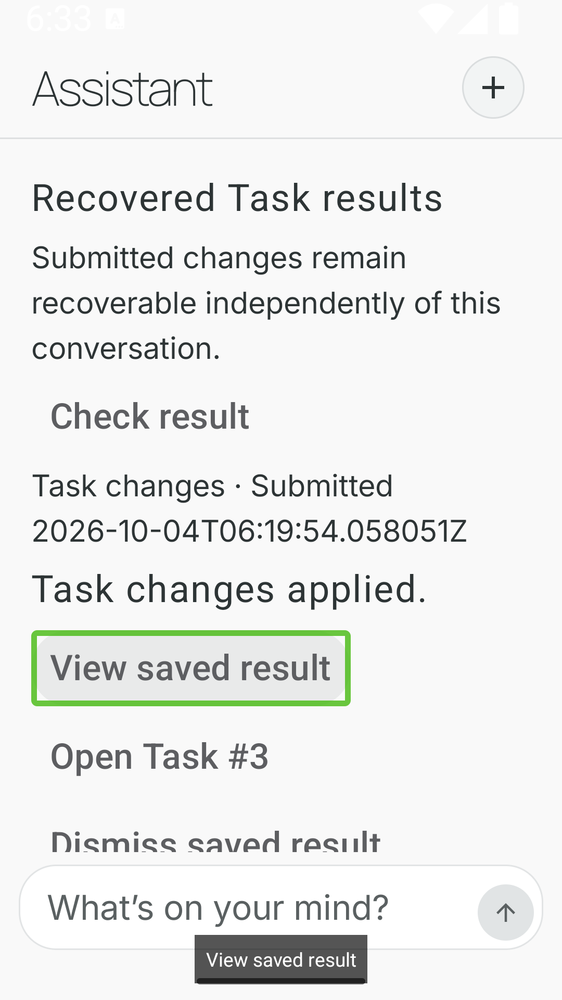
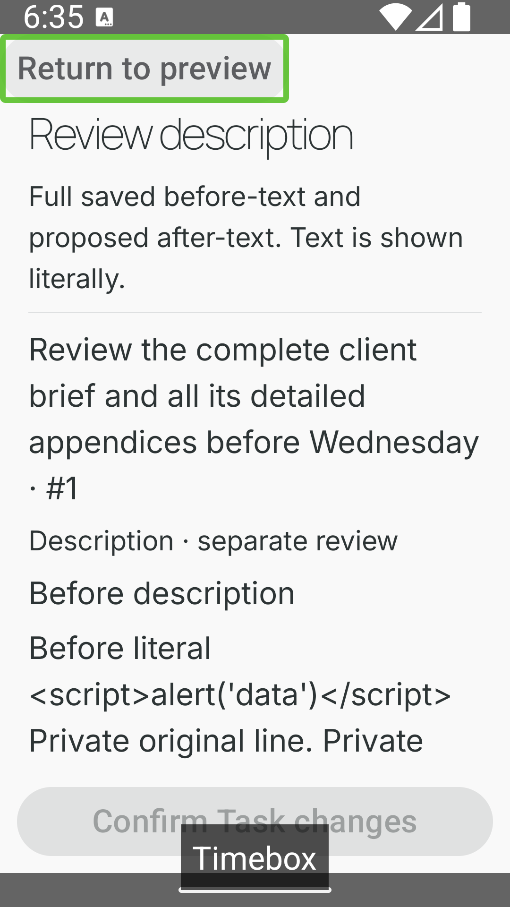
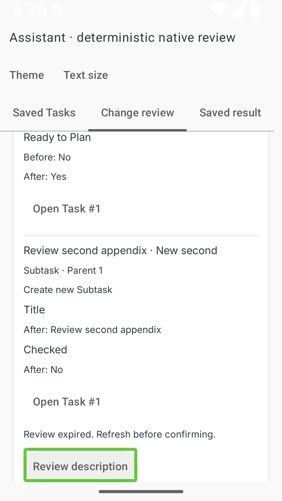

# Assistant task-access integrated verification

Issue [#313](https://github.com/crimsoncaius/timebox/issues/313), attempts 1–2, 2026-10-04.
Branch: `codex/assistant-task-access-batch`. Prerequisite implementation: `0da85e50`.
Authority: [approved handoff](../../specs/assistant-task-access-handoff.md).

**The scoped integration verification passed.** Deterministic integration, native review
and the authorized live rechecks are complete. Initial live failures and a supplemental
exact-text mismatch remain recorded below. After focused adapter/prompt corrections,
current discovery and the complete description read/proposal/review/confirm path passed.
This is bounded provider evidence, not a guarantee of every future model response.
The issue remains open for user review; no release, merge or deployment was performed.

## Repair and new deterministic evidence

The installed LangChain adapter expands every Pydantic default before invoking the
tool function. `read_tasks({mode: search})` therefore reached a second validation with
fields belonging to all four modes, and was rejected. Earlier read tests exercised
the service directly, missing this actual tool boundary. The new adapter regression
failed with that exact error before the repair and passed afterward. The tool now
publishes the same JSON schema and leaves the original input untouched until the
existing strict validation. Explicit invalid mode fields are still rejected.

The prompt now describes search/get description arguments explicitly and requires an
actual successful proposal tool call before claiming a proposal or inviting confirmation.
A deterministic five-call stream exercises three real task reads followed by an
explicit description proposal, confirmation and saved description. This establishes
that the proposal slot remains available after three reads; it does not establish
that the provider will reliably choose it.

The supplemental description run emitted a valid proposal but omitted the requested
terminal period in its tool arguments. The full review exposed this mismatch, so it
was never confirmed. The shared prompt now explicitly preserves exact replacement
punctuation, whitespace and line breaks. The existing real-tool stream regression was
extended to verify exact multiline text in both full review and persisted description;
all nine stream tests passed on PostgreSQL. One explicitly directed post-fix live
rerun of the identical request passed, including the period, confirmation and receipt.

Executed in this slice:

- 274 backend Assistant, Battle Plan, completion, recurrence, Habits and Actual-locking
  tests passed; two database-only cases skipped on SQLite.
- 13 targeted PostgreSQL concurrency tests passed against `assistant_task_access_tests`,
  covering duplicate execution, relevant domain writers and lifecycle races.
- After the repair: 36 read/stream/loop tests passed on SQLite; all 22 matching task
  read/stream tests also passed on PostgreSQL.
- Ruff and `git diff --check` passed.

Reuse the preceding workers' focused evidence: #309's 110 Assistant and 12 PostgreSQL
read tests; #310's 200 focused SQLite and 51 PostgreSQL operation/stream tests; #311's
405 JVM and 13 native tests; #312's final 419 JVM checks, debug APK build, instrumentation
compilation, eight Task Card plus one native HTTP-body regression, and 44 PostgreSQL
operation tests. Android production source did not change in #313, so these JVM/build/
instrumentation results remain applicable. No historical Android baseline failure was
used to excuse a new Assistant failure.

## Live provider evidence and cumulative budget

Configured model stayed `z-ai/glm-5.3-flash`, with both adapter and SDK retries disabled.
Data was synthetic, stored in the separate `assistant_task_access_live` PostgreSQL
database. The retained review database was preserved. A local harness used the actual
API, bounded model loop, tools, capture and confirmation paths. Counters were persisted
before each outbound call. No API key or real user data was written to evidence.

| Scenario | Calls | Model-selected reads | Actual result |
| --- | ---: | ---: | --- |
| Current discovery/card | 3 | 2 rejected reads | Interrupted. Valid model arguments exposed the adapter defect; no snapshot, proposal or mutation. Fixed; supplemental verification below. |
| Ambiguous title | 2 | 1 | Completed with Task Card and Atlas/Beacon clarification. No arbitrary target or proposal. Also verifies post-repair live search/card transport. |
| Known task changed between turns | 1 | 0 | Completed using captured automatic refresh; reported the new title while the acknowledged earlier card remained historical. |
| Ordinary importance edit | 3 | 1 | Completed; one proposal, explicit test confirmation, authoritative applied receipt. Only requested importance changed. |
| Create with two Subtasks | 2 | 0 | Completed; dependent create proposal, explicit test confirmation, applied receipt with parent/child IDs. |
| Explicit description read/edit | 4 | 3 (one invalid) | Completed reads, but no proposal tool call. Model prose claimed submission. No confirmable UI or saved change. Instructions strengthened; supplemental verification below. |
| Authorized discovery recheck | 2 | 1 | Completed current Task Card including blocked work, no private description or mutation. |
| Authorized description recheck | 4 | 2 | Real proposal and full private review available. Requested terminal period omitted in model arguments; strict check withheld confirmation. |
| Directed post-fix description recheck | 4 | 2 | Identical request completed search/get/proposal; full review matched exact requested text. Explicit confirmation applied it exactly; general receipt contained only private-text digest/length. |

**Cumulative usage: 9 scenario executions and 25/30 model calls.** Original usage was
6 scenarios/15 calls. The user then authorized completing the two remaining live gaps;
two supplemental executions used six calls. After the exact-text mismatch, the
orchestrator explicitly directed one post-fix description rerun (four calls) within
the unchanged 30-call ceiling. Each was a deliberate bounded run with no automatic
provider retries. No more executions are planned. Never reset prior usage. Two initial
harness setup mistakes were corrected without repeating provider calls.

Captured attempts retain `task_refresh_v1`, `task_outcomes_v1`, original request/model
results, read errors, snapshot identities, SSE envelopes, terminal status and receipts.
The machine-local durable counter and detailed seeded evidence are in
`C:\Users\Caius\TimeboxRuntime\assistant-task-access-batch\provider-budget.json`.
`batch.json` carries the same cumulative budget. The original, supplemental and exact
rerun harnesses each retain a one-shot starting-counter guard and authorization record.

## Acceptance evidence map

`reads` below means `backend/tests/test_assistant_tasks.py`; `operations` means
`backend/tests/test_assistant_task_operations.py`; `stream` means
`backend/tests/test_assistant_task_stream.py`. References name the relevant existing
checks rather than claiming every suite was rerun in this slice.

| Handoff acceptance row | Evidence / remaining limitation |
| --- | --- |
| Current default | reads: default privacy/purity and literal title/child identity; new real-tool adapter regression; supplemental live current discovery/card passed. |
| Saved recurrence | reads: day carry-over, oldest actionable saved occurrence, typed sessions, clock transition with no persisted skip. |
| Identity ambiguity | Stable manifest/child identity tests; live Atlas/Beacon clarification and card. |
| Paging and limits | reads: fixed manifest, conversation-bound cursor/expiry, lower-bound count, Unicode bytes and nested unavailable positions. |
| Automatic refresh | reads: related labels/children/plans/clock and retained replay; live manual edit then zero-read answer from captured refresh. |
| Refresh failure/overflow | reads: explicit failure/unverified coverage and forty-identity shared nested bound; stored replay unchanged. |
| Privacy and injection | reads and operations: explicit descriptions, truncation, full private review and oversize rejection; native literal-text review. Final live exact-description proposal/full review/confirm passed; private text excluded from general receipt. |
| Create/edit | operations: defaults, strict arguments, relevant guards, unchanged unrelated fields and independent Block types; live ordinary edit and dependent create receipts. |
| Parent/Subtask | operations: completed-parent/reopen/recurring boundary, dependent creates; native parent navigation; live parent plus two children. |
| Complete-now | operations: linked activity, future plans, journal and recoverable Undo; #312 real API/native completion. |
| Earlier completion | operations: date intent, DST, precision, preserved Blocks and zone-change guards; native date-only presentation. |
| Reopen/reminder | operations: completion metadata clear, reminder expiry, deadline-only edit does not re-arm, no old effects restored. |
| Atomic dependencies | operations: later-step fault and completion-journal rollback; PostgreSQL atomic writes. |
| Duplicate create / lost reply | operations: duplicate receipt and reply loss/restart; PostgreSQL duplicate race; #312 real process death with exactly one submission. |
| Delayed HTTP admission | operations: not-seen, abandoned claim, pause-status and admission timeout; Android durable recovery and delayed response-body regression. |
| Relevant concurrency | PostgreSQL writer-race cases cover manual patch/delete, Plan insert/move, activity switch, Project delete, Type rename/merge, reminder claim. |
| Lifecycle races | PostgreSQL confirmation versus close/dismiss/replacement; operations expiry/source/stop and immutable receipt checks. |
| Local synchronization | #312 Activity/readiness unit checks and reservation ordering; native unknown-readiness barrier/outage recovery. |
| Offline/recovery | Android recovery tests: offline refusal, durable-before-send, finite status cycle, endpoint isolation, cap/corruption, new versus same submission retry; real forced death in #312. |
| Undo | operations durable conflict-checked sole completion Undo; #312 real lost-Undo reply and recovery, no tracking restart. |
| Current protocol | stream and Android DTO/controller tests reject mixed/unknown/malformed/unfinished content; current matched Android/API reviewed. |
| Truthful model context | Captured outcomes independent of acknowledgement; fresh conversation isolation. Initial description prose violated the proposal claim rule; no execution authority was fabricated. Both subsequent description runs emitted real proposals after the prompt correction. |
| Native review | Prior native detail/immutable card, light/dark, long content, IME and focus tests; #312 process-death recovery; #313 actual TalkBack and small-screen/system-font checks below. |

## Native review

Used only the owned `emulator-5582` through `scripts/android-emulator.py`. TalkBack
16.0 was actually enabled, bound and speaking. Its speech-output overlay and green
accessibility focus were observed while navigating recovery actions, expanding the
saved receipt, opening description review, and returning with Android Back. Keyboard
focus and TalkBack focus returned to Review description after dialog removal. The
speech overlay confirmed applied-result and action announcements. This is observed
screen-reader output, not a human acoustic/usability evaluation.

The compact review used `1080x1920` at density `480` (360x640 dp), with Android's
system `font_scale=1.6`. The normal recovery screen and full-height description
dialog remained usable. Existing native tests supply dark/light, IME, long full
before/after descriptions and current-detail navigation coverage. An initial direct
injected tap did not establish TalkBack focus at the opener; repeating with keyboard
navigation established the correct focus return without an application change.

Display geometry/font scale and TalkBack were restored to the reservation's defaults.
The final application was relaunched against the updated, provider-disabled review API
and left on the fresh Assistant recovery surface. The saved review database, submitted
operation records and existing process-death evidence were retained.

## Review and continuation

- API: `http://127.0.0.1:12084/docs`, isolated `assistant_task_access_review`, migration 041.
- Native: `emulator-5582`, token `a7b7e9be686c40a29b678c4be43b05be`, storage
  `C:\Users\Caius\TimeboxRuntime\emulators`, retained review hold.
- Runtime record: `C:\Users\Caius\TimeboxRuntime\assistant-task-access-batch\review.json`.
- No PR, deployment, merge or issue closure. Preserve the running review instance.
- Supplemental final integration: provider-disabled API restarted from the final tree;
  health, all six task proposal/operation routes and the retained applied readiness
  receipt verified. Native app force-relaunched and saved result expanded, showing
  Ordinary #3 / Ready to Plan: Yes; emulator returned to its non-expiring review hold.
- Review without provider calls: Check result refreshes operation status; Hide/View
  saved result collapses/expands its receipt; Open Task #3 opens current Task Detail.
- Further integration should reuse this evidence and make no provider calls.
